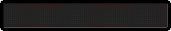

## Summary

[Shubham Darda][1] is a Software Engineer who specializes in designing solutions for complex business problems. He is a strong advocate for writing clear and maintainable code, guided by the principle from Harold Abelson: "Programs must be written for people to read, and only incidentally for machines to execute." He enjoys the process of turning an idea into a finished product and works effectively in disciplined, deadline-oriented environments.

He is also the Architect of [GoDarda][2], a platform he built to provide practical programming resources for the tech community. For GoDarda, he handles everything from the ground up, including web application architecture, UI/UX design, development, and testing.

## Work Experience

> Senior Software Engineer  
**Emerson Innovation Center, Pune**  

> Software Consultant  
**Capgemini Technology Services, Mumbai**  

## Education

> M.Tech. in Data Science & Engineering  
**Birla Institute of Technology and Science, Pilani**

> B.E. in Computer Engineering  
**Savitribai Phule Pune University, Pune**

## Personal Development

- Dedicated to self-development with a strong passion for lifelong learning.
- Committed to adopting new technologies and methodologies to drive continuous professional growth.

[1]: https://godarda.in/shubhamrdarda
[2]: https://godarda.in
